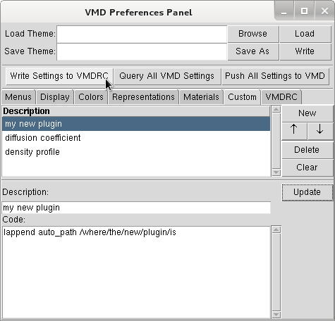

~~Installation~~ Upgrade instructions
========================================

VMD 1.9.1 comes with a very old (0.9) version of Plumed-GUI
pre-installed. Since the built-in version does not support PLUMED 2.0,
updating to the latest version highly recommended.

To upgrade, please follow the directions in this file.

There are two ways to install, depending on whether you have write
privileges in VMD's program directory (i.e. you are the administrator,
or installed VMD as a user). The "without privileges" procedure is
recommended and should work in both scenarios.

Without write privileges (VMD 1.9.1 or lower)
----------------------------------------

You may install the plugin in any directory, as follows:

1. Download and extract the latest Plumed-GUI release from GitHub.

2. Add the following lines to your `.vmdrc` startup file (name and
   location [are different under
   Windows](http://www.ks.uiuc.edu/Research/vmd/vmd-1.7/ug/node197.html))

        lappend auto_path /PATH/TO/EXTRACTED/VMD_PLUMED
        menu main on

   or, alternatively, set the following environment variable (e.g. via modules)

        export TCLLIBPATH="/PATH/TO/EXTRACTED/VMD_PLUMED $TCLLIBPATH"

Without write privileges (VMD 1.9.2 or higher)
----------------------------------------

Follow the same instructions as VMD 1.9.1. The TCLLIBPATH environment
variable should work. However, to insert the `auto_path` instructions
in the startup file, you may need to use the graphical preferences
editor. Refer to the following figure, adjusting the plugin name
(*my new plugin* becomes e.g. *vmdplugin*) and location.

With write privileges
----------------------------------------

In short, replace the _plugins/noarch/tcl/plumed0.9_ directory in
VMD's installation with the archive downloaded from GitHub.

If you need step-by-step directions:

1. Download and extract the latest Plumed-GUI release from GitHub.

2. Identify your VMD installation directory (let's call it
   _$VMDDIR_). This is easiest typing the following command in VMD's
   TkConsole:

          puts $env(VMDDIR)

3. Delete the directory  _$VMDDIR/plugins/noarch/tcl/plumed0.9_, 
   which contains the old version of the plugin.

4. Unzip the archive downloaded at step 1 as a subdirectory of _$VMDDIR/plugins/noarch/tcl/_.  At least the following files should be present:
   * vmdplumed.tcl
   * templates_list_v1.tcl
   * templates_list_v2_autogen.tcl
   * pkgIndex.tcl

5. Done. The plugin should appear in the _Extensions > Analysis >
   Collective Variable Analysis (PLUMED)_ menu upon VMD's next
   start. Verify the running version from _Help > About_.

Prerequisite: PLUMED engine
========================================

Plumed-GUI **requires** a _driver_ executable for your architecture to
be located somewhere in the executable path.  The executables are
named _plumed_ (PLUMED 2.1, recommended) and _driver_ (PLUMED 1.3).
You can have either or both installed.

Until PLUMED 2.1 is officially released, please use the _master_
development branch, which you can obtain from
https://github.com/plumed/plumed2 .

 * **Linux/Unix** and **OSX**: download the code from the [PLUMED home
     page](http://www.plumed-code.org) and build it according to the
     instructions.

 * **Windows**: Plumed-GUI (version > 2.1) provides a _Help > Attempt
   download of prebuilt Windows driver binaries_.  menu entry which
   attempts to get precompiled binaries and to install them in a
   (system specific) directory. The same directory is temporarily
   added to the search path. The method requires enough permissions
   and network access.

If the executables are correctly installed, their location will appear
in the "Path to executable" box; the path can be adjusted manually
(not recommended).

If the Windows-specific automated installation above fails, try to
manually download the pre-compiled binaries for Win32
([driver.exe](http://www.multiscalelab.org/utilities/PlumedGUI?action=AttachFile&do=get&target=driver.exe)
and
[plumed.exe](http://www.multiscalelab.org/utilities/PlumedGUI?action=AttachFile&do=get&target=plumed.exe))
and copy them e.g. in ''c:\windows'' or in VMD's directory.  If all
else fails, you can try to cross-compile yourself, as shown in the
[PLUMED-WIN32.md](PLUMED-WIN32.md) file.

