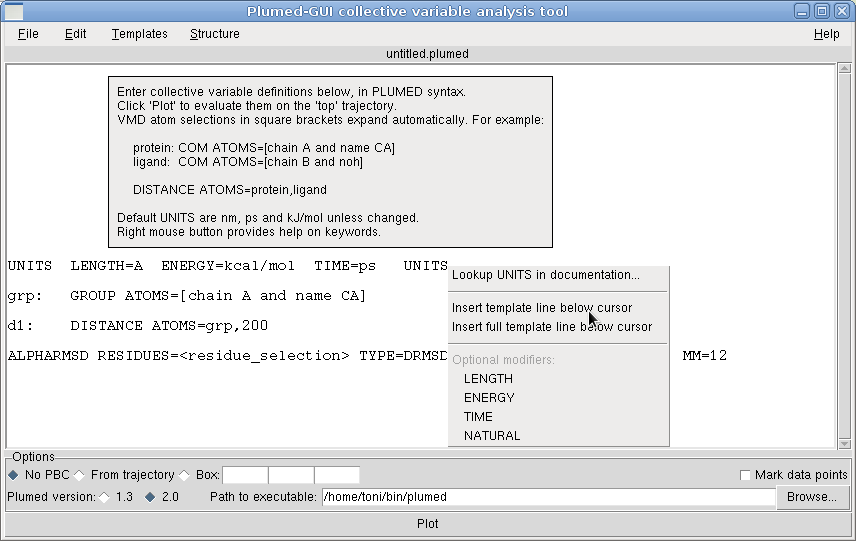
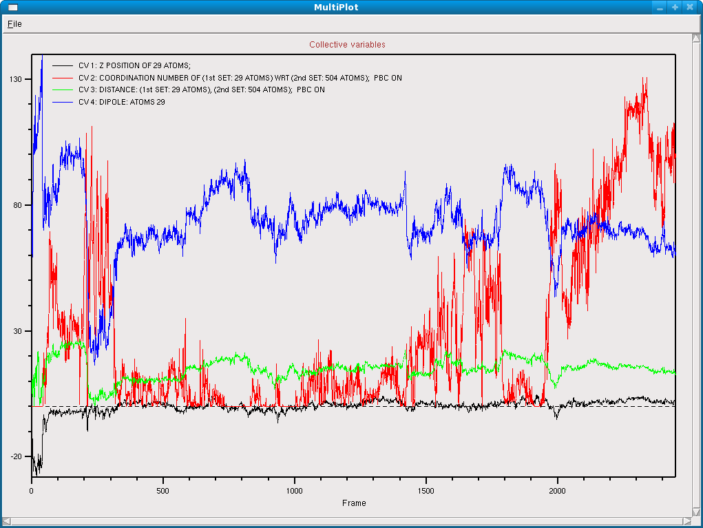
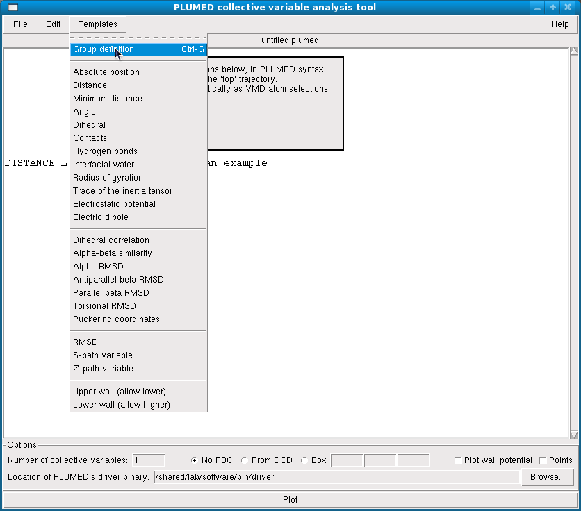
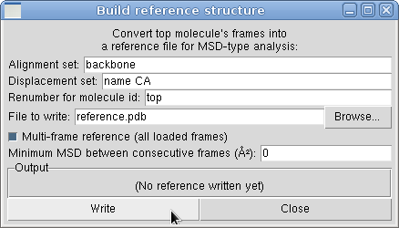
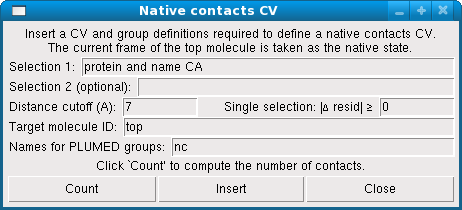
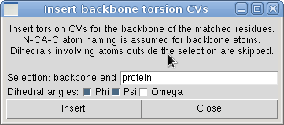

A Plumed collective variable analysis tool for VMD
==================================================

The *PLUMED-GUI collective variable analysis tool* is a plugin for the
[Visual Molecular Dynamics (VMD)](http://www.ks.uiuc.edu/Research/vmd/)
software that provides access to the extensive set of collective
variables (CV) defined in the [PLUMED](http://www.plumed-code.org/). It
allows you to:

-   analyze the currently loaded trajectory by evaluating and plotting
    arbitrary CVs

-   use VMD's atom selection keywords to define atom groups and
    ready-made templates for common CVs

-   export the CV definition file for use in MD simulations

-   prepare reference files for RMSD, path-variable, native contacts,
    etc.

Installation
------------

Please download the latest distribution from
[tonigi/vmd\_plumed](https://github.com/tonigi/vmd_plumed) on
[GitHub](http://www.multiscalelab.org/utilities/PlumedGUI/GitHub#) and
follow the instructions in the
[doc/INSTALL.md](https://github.com/tonigi/vmd_plumed/blob/master/doc/INSTALL.md)
file. Note that you will also need PLUMED's *driver* and/or *plumed*
executables.

For a primer on the use of PLUMED, see e.g. [the official
website](http://www.plumed-code.org/) and/or one of the [excellent
tutorials](https://sites.google.com/site/plumedtutorial2010/) available.

Usage
-----

The usage of the plugin is straightforward.

1.  From VMD's main window, select "Extensions \> Analysis \> Collective
    variable analysis (PLUMED)"

2.  Edit the CV definition file, defining one or more CVs

3.  Enter the number of CVs defined in the corresponding box (this will
    be fixed in a future PLUMED release)

4.  Click "Plot". This will open a plot window with the selected CVs.

Square brackets can be used to conveniently define atom groups (Ctrl-G).
During evaluation, atom selection keywords in square brackets are
replaced with a list of the corresponding *serial* numbers for the top
molecule.

When **Plot** is clicked, the currently loaded trajectory is exported to
a temporary directory (shown in the console), and the *driver* utility
is invoked. If there are no errors, a plot will show the CVs evaluated
on the frames of the current trajectory.

**Troubleshooting**: In case of errors, the console will provide
diagnostics and the location of the temporary directory where
computations are run. Common sources of error are:

-   Hills deposition should be disabled.

-   Improperly set periodic boundary conditions, especially when dealing
    with non-wrapped solvent or with MD engines which "break" molecules
    by wrapping them.

The *File* menu
-------------

CV definition files can be opened, edited and saved as usual. **Save**
and **Save as...** save the currently open file verbatim, while the
**Export...** function performs the atom selection replacements (see
below), thus creating a *META\_INP* file that can be used directly in
simulations.

The *Edit* menu
-------------

The **Edit** menu provides the usual cut-copy-paste text-editing
options.

The *Templates* menu
------------------

The **Templates** menu provides shortcuts for most CVs supported by
PLUMED. Please refer to PLUMED's manual for the full syntax.

The list of keywords for PLUMED 2 are generated when the package is
built, matching the version current at that time; therefore, the
template syntax may have slight differences with respect to the PLUMED
version that you are using locally (and that will work).

The *Electrostatic energy* and *Dipole* CVs require charges to be
defined in the currently loaded molecule, so AMBER or CHARMM topology
file have to be loaded beforehand.

Structure files (used for `RMSD`, `Z_PATH`, `S_PATH`, etc.) must be
referenced by **absolute** pathname.

The template menu does not hold the full list of the CVs implemented in
PLUMED, but all of them will work anyway when typed in.

The *Structure* menu
------------------

The **Structure** menu provides functions for entering complex CVs.

### Reference structures for RMSD and path variables

The **Structure>Prepare reference structure...** dialog can be used to
prepare pseudo-PDB files that can be used as reference structures for
RMSD, path-variables, etc.

Two VMD atom selections are required to define the set of atoms that
will be used for alignment (alignment set) and for the distance
measurement (displacement set), respectively. The *currently selected
frame of the top molecule* is used to create a reference file;
numbering can be altered to conform to another molecule. The file
format is specified in the 'Path collective variables' section of the
PLUMED manual.

**Notes:**

-   After generating the structures, remember to set the top molecule to
    the one you want to analyze.

-   Structures must be referenced by **absolute** pathname in the PLUMED
    script.

-   The RMSD keyword has been renamed to MSD in PLUMED 1.3.

### Native contacts

The **Structure>Native contacts CV** inserts a native-contacts CV. The
*currently selected frame of the top molecule* is taken as the native
state. Atom numbers are adapted to fit the structure indicated in the
**target molecule** field. If **selection 2** is given, only
intermolecular contacts (between selection 1 and 2) are counted.
Otherwise, contacts internal in **selection 1** are considered. The
**Distance cutoff** selects the radius to consider contacts in the
native state. If only one selection is given, contacts can be filtered
with the **Δ resid** option (see description in [RMSD trajectory tool
enhanced with native
contacts](http://www.multiscalelab.org/utilities/RMSDTTNC)).
**Group name** specifies the label for two atom lists (that will be
placed at the top of the plumed file). *Note: After generating the CV
lines, remember to set the top molecule to the one you want to analyze.*

### Backbone torsion CVs

The **Structure>Insert backbone torsions...** inserts a list of CVs
corresponding to the φ, ψ, and ω Ramachandran angles defined in an
atom selection. Note that N-CA-C atom names are assumed for backbone
atoms.  Dihedrals involving atoms outside the selection are not
added. The ω angle is intended between residue *i* and *i+1*.

Citation
--------

You are kindly requested to cite the following paper in any publication
resulting from the use of Plumed-GUI (in addition to other possibly
relevant Plumed citations):

-   Toni Giorgino, *Plumed-GUI: an environment for the interactive
    development of molecular dynamics analysis and biasing scripts*,
    Computer Physics Communications, Volume 185, Issue 3, March 2014,
    Pages 1109-1114
    [10.1016/j.cpc.2013.11.019](http://dx.doi.org/10.1016/j.cpc.2013.11.019)
    or [arxiv:1312.3190](http://arxiv.org/abs/1312.3190).

License
-------

By downloading the software you agree to comply with the terms of the
3-clause BSD license.

Acknowledgments
---------------

Work on this plugin started while at the Computational Biophysics
laboratory (Prof. De Fabritiis, GRIB-IMIM, Universitat Pompeu
Fabra). Former support by grant 2009BP-B00109, Agència de Gestió
d'Ajuts Universitaris i de Recerca - Generalitat de Catalunya is
gratefully acknowledged.
